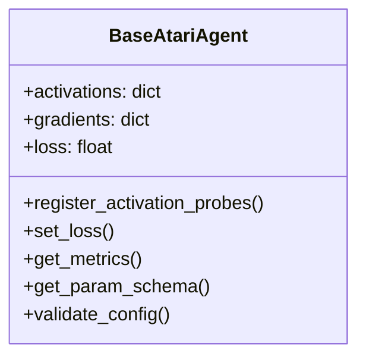
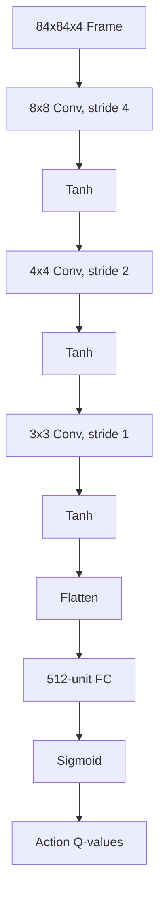

# Agents Module

## Available Agents

### Value-Based Agents
- `CriticalAtariDQN`: DQN with critical network regularization
  - 3 CNN layers + FC
  - Tanh activations
  - Jacobian norm regularization
- `DynamicAtariUDQN`: Uncertainty-aware DQN
- `GatedAtariUDQN`: Gated version with uncertainty
- `StandardDQN`: Basic Deep Q-Network

### Policy-Based Agents
- `PongA2CAgent`: Advantage Actor-Critic for Pong
- `PPOAgent`: Proximal Policy Optimization
- `CriticalGatedAgent`: Gated policy with critical features

## BaseAtariAgent Features


## CriticalAtariDQN Architecture


## Usage Examples

### Basic Usage
```python
from criticalnets.agents import get_agent_class

agent_class = get_agent_class('CriticalAtariDQN')
agent = agent_class(config={
    'device': 'cuda',
    'frame_stack': 4,
    'reg_strength': 1.0
}, action_space=6)

q_values = agent(state_tensor)  # Get action values
```

### Monitoring
```python
# Track specific layer activations
agent.register_activation_probes(['conv1', 'conv2'])

# After forward pass:
print(agent.activations['conv1'].shape)  # Activation tensor
print(agent.gradients['conv1.weight'])  # Parameter gradients
```

